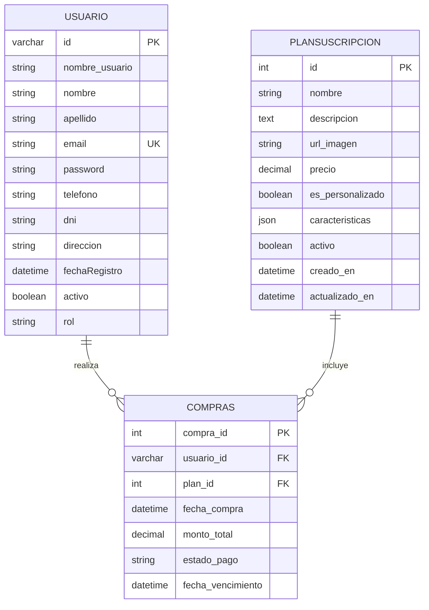
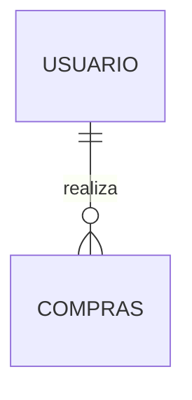

# 🚀 Sprint 3 - Backend ClinicFlow

## División en 3 Desarrolladores

---

## 📊 DESARROLLADOR 1: Migración de Base de Datos y Refactorización de Usuario

### 🎯 Objetivos

- Adaptar la base de datos a las especificaciones del frontend
- Refactorizar CRUD de usuarios con nuevos campos
- Crear diagrama de casos de uso del módulo Usuario

### 📋 Tareas Detalladas

#### 1. Script SQL de Migración (`clinicflow_sprint3.sql`)

**Modificar tabla `usuario`:**

```sql
-- Backup de datos existentes (opcional pero recomendado)
CREATE TABLE usuario_backup AS SELECT * FROM usuario;

-- Eliminar tabla antigua
DROP TABLE IF EXISTS usuario;

-- Crear nueva estructura según frontend
CREATE TABLE usuario (
    id VARCHAR(50) PRIMARY KEY,
    nombre_usuario VARCHAR(100) NOT NULL UNIQUE,
    nombre VARCHAR(100) NOT NULL,
    apellido VARCHAR(100) NOT NULL,
    email VARCHAR(255) UNIQUE NOT NULL,
    password VARCHAR(255) NOT NULL,
    telefono VARCHAR(20),
    dni VARCHAR(20),
    direccion VARCHAR(255),
    fechaRegistro TIMESTAMP DEFAULT CURRENT_TIMESTAMP,
    activo BOOLEAN DEFAULT TRUE,
    rol VARCHAR(50) DEFAULT 'estandar',
    CHECK (rol IN ('administrador', 'estandar'))
);

-- Migrar datos del backup (ajustar según necesidad)
INSERT INTO usuario (id, nombre_usuario, nombre, apellido, email, password, direccion, rol, activo)
SELECT 
    CONCAT('user_', LPAD(idUsuario, 6, '0')),
    nombre_usuario,
    COALESCE(nombre, 'Sin Nombre'),
    COALESCE(apellido, 'Sin Apellido'),
    COALESCE(email, CONCAT(nombre_usuario, '@temp.com')),
    password,
    direccion,
    rol,
    TRUE
FROM usuario_backup;

-- Crear usuario admin por defecto si no existe
INSERT IGNORE INTO usuario (id, nombre_usuario, nombre, apellido, email, password, rol, activo)
VALUES (
    'user_admin_001',
    'admin',
    'Administrador',
    'Principal',
    'admin@clinicflow.com',
    SHA2('admin123', 256),
    'administrador',
    TRUE
);
```

#### 2. Refactorizar `crud_usuarios.py`

**Adaptar funciones a nueva estructura:**

- `crear_usuario()`: Agregar parámetros `telefono`, `dni`, generar `id` automático
- `obtener_usuario_por_nombre()`: Ajustar SELECT con nuevos campos
- `obtener_todos_los_usuarios()`: Incluir campos `telefono`, `dni`, `activo`, `fechaRegistro`
- `actualizar_usuario()`: Agregar opciones para `telefono`, `dni`, `activo`
- **NUEVA**: `obtener_usuario_por_id()` - Usar `id` VARCHAR en lugar de `idUsuario` INT

**Ejemplo de refactorización:**

```python
def crear_usuario(nombre_usuario, nombre, apellido, email, contrasena_hash, 
                  direccion=None, telefono=None, dni=None, rol='estandar'):
    """Inserta un nuevo usuario con la estructura actualizada."""
    conn = None
    try:
        conn = get_db_connection()
        if conn is None:
            return None
        cursor = conn.cursor()
        
        # Generar ID único
        cursor.execute("SELECT COUNT(*) FROM usuario")
        count = cursor.fetchone()[0]
        user_id = f"user_{nombre_usuario}_{count+1:03d}"
        
        cursor.execute("""
            INSERT INTO usuario 
            (id, nombre_usuario, nombre, apellido, email, password, 
             direccion, telefono, dni, rol, activo, fechaRegistro)
            VALUES (%s, %s, %s, %s, %s, %s, %s, %s, %s, %s, TRUE, NOW())
        """, (user_id, nombre_usuario, nombre, apellido, email, 
              contrasena_hash, direccion, telefono, dni, rol))
        
        conn.commit()
        return user_id
    except Error as e:
        # [Mantener manejo de errores actual]
```

#### 3. Actualizar `database.py`

- Modificar `initialize_db()` para crear tabla `usuario` con nueva estructura
- Asegurar que el admin por defecto use la nueva estructura

#### 4. Diagrama de Casos de Uso - Módulo Usuario

**Casos de uso a documentar:**

- **Actor**: Visitante
  - Registrar usuario
- **Actor**: Usuario Estándar
  - Iniciar sesión
  - Ver datos personales
  - Editar perfil (nombre, apellido, email, teléfono, dni, dirección)
  - Cambiar contraseña
- **Actor**: Administrador
  - Todos los casos del Usuario Estándar +
  - Listar todos los usuarios
  - Cambiar rol de usuario
  - Eliminar usuario
  - Activar/desactivar usuario

**Formato:** Diagrama UML (puedes usar draw.io, PlantUML o similar)

### ✅ Entregables

1. `clinicflow_sprint3.sql` - Script de migración completo
2. `crud_usuarios.py` - Refactorizado con nuevos campos
3. `database.py` - Función `initialize_db()` actualizada
4. `diagrama_casos_uso_usuario.png` - Diagrama de casos de uso
5. **Documentación**: `MIGRACION.md` explicando los cambios realizados

---

## 🛒 DESARROLLADOR 2: Entidad PlanSuscripcion y Relación Compras

### 🎯 Objetivos

- Crear tabla `PlanSuscripcion` según especificaciones frontend
- Desarrollar CRUD completo de planes
- Implementar consultas JOIN entre usuario-compras-planes

### 📋 Tareas Detalladas

#### 1. Extender Script SQL (`agregar a clinicflow_sprint3.sql`)

```sql
-- Crear tabla PlanSuscripcion
DROP TABLE IF EXISTS PlanSuscripcion;
CREATE TABLE PlanSuscripcion (
    id INT PRIMARY KEY AUTO_INCREMENT,
    nombre VARCHAR(100) NOT NULL UNIQUE,
    descripcion TEXT,
    url_imagen VARCHAR(255),
    precio DECIMAL(10,2) NULL,
    es_personalizado BOOLEAN DEFAULT FALSE,
    caracteristicas JSON,
    activo BOOLEAN DEFAULT TRUE,
    creado_en TIMESTAMP DEFAULT CURRENT_TIMESTAMP,
    actualizado_en TIMESTAMP DEFAULT CURRENT_TIMESTAMP ON UPDATE CURRENT_TIMESTAMP
);

-- Insertar planes de ejemplo
INSERT INTO PlanSuscripcion (nombre, descripcion, url_imagen, precio, es_personalizado, caracteristicas) VALUES
('Básico', 
 'Funcionalidades esenciales para consultorios pequeños', 
 '../img/plan-basico.jpg',
 50.00,
 FALSE,
 '["Gestión de hasta 50 pacientes", "Agenda básica", "Historial clínico", "Soporte por email"]'),
 
('Estándar', 
 'Gestión completa y reportes para clínicas medianas', 
 '../img/plan-estandar.jpg',
 120.00,
 FALSE,
 '["Gestión ilimitada de pacientes", "Agenda avanzada", "Reportes y estadísticas", "Facturación electrónica", "Soporte prioritario"]'),
 
('Premium', 
 'Funcionalidades avanzadas para instituciones grandes', 
 '../img/plan-premium.jpg',
 250.00,
 FALSE,
 '["Todas las funciones de Estándar", "Integración con laboratorios", "API para terceros", "Multi-sede", "Soporte 24/7", "Capacitación incluida"]'),
 
('Personalizado',
 'Solución a medida para empresas',
 '../img/plan-personalizado.jpg',
 NULL,
 TRUE,
 '["Instalación en servidores propios", "Personalización de marca", "Funcionalidades a medida", "Soporte dedicado"]');

-- Crear tabla Compras (relación entre usuario y plan)
DROP TABLE IF EXISTS Compras;
CREATE TABLE Compras (
    compra_id INT AUTO_INCREMENT PRIMARY KEY,
    usuario_id VARCHAR(50) NOT NULL,
    plan_id INT NOT NULL,
    fecha_compra DATETIME NOT NULL DEFAULT CURRENT_TIMESTAMP,
    monto_total DECIMAL(10, 2) NOT NULL,
    estado_pago VARCHAR(50) NOT NULL DEFAULT 'Pendiente',
    fecha_vencimiento DATE,
    
    FOREIGN KEY (usuario_id) REFERENCES usuario(id) ON DELETE CASCADE,
    FOREIGN KEY (plan_id) REFERENCES PlanSuscripcion(id) ON DELETE RESTRICT,
    CHECK (estado_pago IN ('Pendiente', 'Pagado', 'Cancelado', 'Vencido'))
);

-- Datos de prueba para Compras
INSERT INTO Compras (usuario_id, plan_id, monto_total, estado_pago, fecha_vencimiento)
VALUES 
('user_admin_001', 2, 120.00, 'Pagado', DATE_ADD(CURDATE(), INTERVAL 1 MONTH));
```

#### 2. Crear `crud_planes.py`

**Estructura completa del archivo:**

```python
from mysql.connector import Error
from database import get_db_connection
import json

def crear_plan(nombre, descripcion, precio, url_imagen=None, 
               es_personalizado=False, caracteristicas=None):
    """Inserta un nuevo plan de suscripción."""
    conn = None
    try:
        conn = get_db_connection()
        if conn is None:
            return None
        cursor = conn.cursor()
        
        # Convertir lista de características a JSON
        caracteristicas_json = json.dumps(caracteristicas) if caracteristicas else None
        
        cursor.execute("""
            INSERT INTO PlanSuscripcion 
            (nombre, descripcion, url_imagen, precio, es_personalizado, caracteristicas, activo)
            VALUES (%s, %s, %s, %s, %s, %s, TRUE)
        """, (nombre, descripcion, url_imagen, precio, es_personalizado, caracteristicas_json))
        
        conn.commit()
        return cursor.lastrowid
    except Error as e:
        print(f"Error al crear plan: {e}")
        if conn:
            conn.rollback()
        return None
    finally:
        if conn and conn.is_connected():
            cursor.close()
            conn.close()

def obtener_plan_por_id(plan_id):
    """Obtiene un plan por su ID."""
    conn = None
    try:
        conn = get_db_connection()
        if conn is None:
            return None
        cursor = conn.cursor()
        cursor.execute("""
            SELECT id, nombre, descripcion, url_imagen, precio, 
                   es_personalizado, caracteristicas, activo, 
                   creado_en, actualizado_en
            FROM PlanSuscripcion
            WHERE id = %s
        """, (plan_id,))
        
        result = cursor.fetchone()
        if result:
            # Convertir JSON de características a lista
            plan = list(result)
            if plan[6]:  # caracteristicas
                plan[6] = json.loads(plan[6])
            return tuple(plan)
        return None
    except Error as e:
        print(f"Error al obtener plan: {e}")
        return None
    finally:
        if conn and conn.is_connected():
            cursor.close()
            conn.close()

def obtener_todos_los_planes(solo_activos=True):
    """Retorna lista de todos los planes."""
    conn = None
    try:
        conn = get_db_connection()
        if conn is None:
            return []
        cursor = conn.cursor()
        
        query = """
            SELECT id, nombre, descripcion, precio, es_personalizado, activo
            FROM PlanSuscripcion
        """
        if solo_activos:
            query += " WHERE activo = TRUE"
        query += " ORDER BY precio ASC"
        
        cursor.execute(query)
        return cursor.fetchall()
    except Error as e:
        print(f"Error al obtener planes: {e}")
        return []
    finally:
        if conn and conn.is_connected():
            cursor.close()
            conn.close()

def actualizar_plan(plan_id, nombre=None, descripcion=None, precio=None, 
                    url_imagen=None, caracteristicas=None, activo=None):
    """Actualiza un plan existente."""
    conn = None
    try:
        conn = get_db_connection()
        if conn is None:
            return False
        cursor = conn.cursor()
        
        updates = []
        params = []
        
        if nombre is not None:
            updates.append("nombre = %s")
            params.append(nombre)
        if descripcion is not None:
            updates.append("descripcion = %s")
            params.append(descripcion)
        if precio is not None:
            updates.append("precio = %s")
            params.append(precio)
        if url_imagen is not None:
            updates.append("url_imagen = %s")
            params.append(url_imagen)
        if caracteristicas is not None:
            updates.append("caracteristicas = %s")
            params.append(json.dumps(caracteristicas))
        if activo is not None:
            updates.append("activo = %s")
            params.append(activo)
        
        if not updates:
            print("No hay datos para actualizar.")
            return False
        
        query = f"UPDATE PlanSuscripcion SET {', '.join(updates)} WHERE id = %s"
        params.append(plan_id)
        
        cursor.execute(query, tuple(params))
        conn.commit()
        return cursor.rowcount > 0
    except Error as e:
        print(f"Error al actualizar plan: {e}")
        if conn:
            conn.rollback()
        return False
    finally:
        if conn and conn.is_connected():
            cursor.close()
            conn.close()

def eliminar_plan(plan_id):
    """Elimina un plan (soft delete - marca como inactivo)."""
    return actualizar_plan(plan_id, activo=False)
```

#### 3. Crear `crud_compras.py` con Consultas JOIN

```python
from mysql.connector import Error
from database import get_db_connection

def registrar_compra(usuario_id, plan_id, monto_total, estado_pago='Pendiente'):
    """Registra una nueva compra."""
    conn = None
    try:
        conn = get_db_connection()
        if conn is None:
            return None
        cursor = conn.cursor()
        
        cursor.execute("""
            INSERT INTO Compras 
            (usuario_id, plan_id, monto_total, estado_pago, fecha_vencimiento)
            VALUES (%s, %s, %s, %s, DATE_ADD(CURDATE(), INTERVAL 1 MONTH))
        """, (usuario_id, plan_id, monto_total, estado_pago))
        
        conn.commit()
        return cursor.lastrowid
    except Error as e:
        print(f"Error al registrar compra: {e}")
        if conn:
            conn.rollback()
        return None
    finally:
        if conn and conn.is_connected():
            cursor.close()
            conn.close()

def obtener_compras_con_detalle():
    """
    CONSULTA JOIN REQUERIDA:
    Muestra listado de compras con datos del usuario y plan adquirido.
    """
    conn = None
    try:
        conn = get_db_connection()
        if conn is None:
            return []
        cursor = conn.cursor()
        
        cursor.execute("""
            SELECT
                C.compra_id,
                U.nombre AS nombre_cliente,
                U.apellido AS apellido_cliente,
                U.email AS email_cliente,
                P.nombre AS nombre_plan,
                C.monto_total,
                DATE(C.fecha_compra) AS fecha_compra,
                C.estado_pago,
                C.fecha_vencimiento
            FROM Compras C
            INNER JOIN usuario U ON C.usuario_id = U.id
            INNER JOIN PlanSuscripcion P ON C.plan_id = P.id
            ORDER BY C.fecha_compra DESC
        """)
        
        return cursor.fetchall()
    except Error as e:
        print(f"Error al obtener compras: {e}")
        return []
    finally:
        if conn and conn.is_connected():
            cursor.close()
            conn.close()

def obtener_compras_por_usuario(usuario_id):
    """Obtiene el historial de compras de un usuario específico."""
    conn = None
    try:
        conn = get_db_connection()
        if conn is None:
            return []
        cursor = conn.cursor()
        
        cursor.execute("""
            SELECT
                C.compra_id,
                P.nombre AS plan,
                C.monto_total,
                C.fecha_compra,
                C.estado_pago,
                C.fecha_vencimiento
            FROM Compras C
            INNER JOIN PlanSuscripcion P ON C.plan_id = P.id
            WHERE C.usuario_id = %s
            ORDER BY C.fecha_compra DESC
        """, (usuario_id,))
        
        return cursor.fetchall()
    except Error as e:
        print(f"Error al obtener compras del usuario: {e}")
        return []
    finally:
        if conn and conn.is_connected():
            cursor.close()
            conn.close()
```

#### 4. Diagrama de Casos de Uso - Módulo Planes/Compras

**Casos de uso:**

- **Administrador**:
  - Crear plan
  - Modificar plan
  - Eliminar/desactivar plan
  - Visualizar todos los planes
  - Ver listado de compras (con JOIN)
  - Ver detalle de compra
- **Usuario Estándar**:
  - Ver catálogo de planes activos
  - Ver mis compras
  - Consultar detalle de mi suscripción

### ✅ Entregables

1. Extensión de `clinicflow_sprint3.sql` con tablas `PlanSuscripcion` y `Compras`
2. `crud_planes.py` - CRUD completo de planes
3. `crud_compras.py` - Gestión de compras con consultas JOIN
4. `diagrama_casos_uso_planes.png` - Diagrama de casos de uso
5. **Script de prueba**: `test_planes_compras.py` para demostrar consultas JOIN

---

## 🖥️ DESARROLLADOR 3: Integración en main.py y Diagramas UML

### 🎯 Objetivos

- Integrar nuevas funcionalidades en la interfaz por consola
- Actualizar Diagrama de Clases
- Crear Modelo Relacional (DER) actualizado

### 📋 Tareas Detalladas

#### 1. Actualizar `main.py`

**Agregar nuevos menús:**

```python
# Agregar al menú de administrador
def mostrar_menu_administrador(usuario):
    while True:
        print(f"\n--- Menú de Administrador ({usuario.nombre_usuario}) ---")
        print("1. Ver mis datos personales")
        print("2. Visualizar listado de usuarios")
        print("3. Cambiar rol de usuario")
        print("4. Eliminar usuario")
        print("5. Editar mi perfil")
        print("--- GESTIÓN DE PLANES ---")
        print("6. Ver catálogo de planes")
        print("7. Crear nuevo plan")
        print("8. Modificar plan")
        print("9. Desactivar plan")
        print("--- GESTIÓN DE COMPRAS ---")
        print("10. Ver todas las compras (JOIN)")
        print("11. Registrar compra manual")
        print("12. Cerrar sesión")
        # [Implementar opciones 6-11]

# Agregar al menú estándar
def mostrar_menu_estandar(usuario):
    while True:
        print(f"\n--- Menú de Usuario Estándar ({usuario.nombre_usuario}) ---")
        print("1. Ver mis datos personales")
        print("2. Editar mi perfil")
        print("3. Ver catálogo de planes")
        print("4. Ver mis compras")
        print("5. Cerrar sesión")
        # [Implementar opciones 3-4]
```

**Funciones auxiliares a crear:**

```python
from crud_planes import (
    crear_plan, obtener_todos_los_planes, 
    obtener_plan_por_id, actualizar_plan
)
from crud_compras import (
    obtener_compras_con_detalle, 
    obtener_compras_por_usuario,
    registrar_compra
)

def mostrar_catalogo_planes():
    """Muestra todos los planes activos con formato."""
    planes = obtener_todos_los_planes(solo_activos=True)
    
    if not planes:
        print("No hay planes disponibles.")
        return
    
    print("\n" + "="*60)
    print("           CATÁLOGO DE PLANES DE SUSCRIPCIÓN")
    print("="*60)
    
    for plan in planes:
        plan_id, nombre, descripcion, precio, es_personalizado, activo = plan
        print(f"\n[ID: {plan_id}] {nombre.upper()}")
        print(f"Descripción: {descripcion}")
        
        if es_personalizado:
            print("Precio: A COTIZAR")
        else:
            print(f"Precio: ${precio:.2f}/mes")
        print("-" * 60)
    
    input("\nPresione ENTER para continuar...")

def ejecutar_creacion_plan():
    """Interfaz para crear un nuevo plan."""
    print("\n--- Crear Nuevo Plan ---")
    nombre = input("Nombre del plan: ")
    descripcion = input("Descripción: ")
    url_imagen = input("URL de imagen (opcional): ") or None
    
    es_personalizado = input("¿Es plan personalizado? (s/n): ").lower() == 's'
    
    if es_personalizado:
        precio = None
    else:
        try:
            precio = float(input("Precio mensual: "))
        except ValueError:
            print("Precio inválido.")
            return
    
    # Ingresar características
    print("Ingrese características (una por línea, vacío para terminar):")
    caracteristicas = []
    while True:
        caract = input("- ")
        if not caract:
            break
        caracteristicas.append(caract)
    
    plan_id = crear_plan(nombre, descripcion, precio, url_imagen, 
                         es_personalizado, caracteristicas)
    
    if plan_id:
        print(f"Plan '{nombre}' creado exitosamente (ID: {plan_id}).")
    else:
        print("Error al crear el plan.")

def mostrar_listado_compras_join():
    """
    REQUISITO: Muestra listado usando JOIN entre tablas.
    """
    compras = obtener_compras_con_detalle()
    
    if not compras:
        print("No hay compras registradas.")
        return
    
    print("\n" + "="*80)
    print("              LISTADO DE COMPRAS (JOIN: Usuario-Compras-Planes)")
    print("="*80)
    print(f"{'ID':<5} {'Cliente':<25} {'Email':<25} {'Plan':<15} {'Monto':>10} {'Estado':<12}")
    print("-"*80)
    
    for compra in compras:
        compra_id, nombre, apellido, email, plan, monto, fecha, estado, venc = compra
        nombre_completo = f"{nombre} {apellido}"
        print(f"{compra_id:<5} {nombre_completo:<25} {email:<25} {plan:<15} ${monto:>9.2f} {estado:<12}")
    
    print("-"*80)
    input("\nPresione ENTER para continuar...")
```

#### 2. Crear Diagrama de Clases Actualizado

**Clases a incluir:**

```code
📦 Sistema ClinicFlow - Diagrama de Clases

┌─────────────────────────┐
│       Usuario           │
├─────────────────────────┤
│ - id: str               │
│ - nombre_usuario: str   │
│ - nombre: str           │
│ - apellido: str         │
│ - email: str            │
│ - password: str         │
│ - telefono: str         │
│ - dni: str              │
│ - direccion: str        │
│ - fechaRegistro: date   │
│ - activo: bool          │
│ - rol: str              │
├─────────────────────────┤
│ + registrar_nuevo_usuario()│
│ + iniciar_sesion()      │
│ + obtener_datos_personales()│
│ + actualizar_datos()    │
│ + cambiar_rol_usuario() │
│ + eliminar_usuario_por_id()│
└─────────────────────────┘
           │ 1
           │ realiza
           │
           ▼ *
┌─────────────────────────┐
│       Compra            │
├─────────────────────────┤
│ - compra_id: int        │
│ - usuario_id: str (FK)  │
│ - plan_id: int (FK)     │
│ - fecha_compra: datetime│
│ - monto_total: decimal  │
│ - estado_pago: str      │
│ - fecha_vencimiento: date│
├─────────────────────────┤
│ + registrar_compra()    │
│ + obtener_compras_usuario()│
│ + obtener_compras_con_detalle()│
└─────────────────────────┘
           │ *
           │ incluye
           │
           ▼ 1
┌─────────────────────────┐
│   PlanSuscripcion       │
├─────────────────────────┤
│ - id: int               │
│ - nombre: str           │
│ - descripcion: text     │
│ - url_imagen: str       │
│ - precio: decimal       │
│ - es_personalizado: bool│
│ - caracteristicas: JSON │
│ - activo: bool          │
│ - creado_en: timestamp  │
│ - actualizado_en: timestamp│
├─────────────────────────┤
│ + crear_plan()          │
│ + obtener_plan_por_id() │
│ + obtener_todos_planes()│
│ + actualizar_plan()     │
│ + eliminar_plan()       │
└─────────────────────────┘
```

**Formato:** Usar herramienta UML (draw.io, PlantUML, StarUML, etc.)

#### 3. Crear Diagrama Entidad-Relación (DER) Actualizado

**Entidades y relaciones:**



**Formato:** Usar herramienta de modelado de BD (MySQL Workbench, dbdiagram.io, draw.io)

#### 4. Crear Modelo Relacional (Esquema SQL documentado)

**Archivo `MODELO_RELACIONAL.md`:**

```markdown
# Modelo Relacional - ClinicFlow E-commerce

## Esquema Relacional en Notación

**usuario**(<u>id</u>, nombre_usuario, nombre, apellido, email, password, telefono, dni, direccion, fechaRegistro, activo, rol)
- Restricciones:
  - email UNIQUE
  - nombre_usuario UNIQUE
  - rol ∈ {'administrador', 'estandar'}

**PlanSuscripcion**(<u>id</u>, nombre, descripcion, url_imagen, precio, es_personalizado, caracteristicas, activo, creado_en, actualizado_en)
- Restricciones:
  - nombre UNIQUE
  - precio puede ser NULL si es_personalizado = TRUE

**Compras**(<u>compra_id</u>, *usuario_id*, *plan_id*, fecha_compra, monto_total, estado_pago, fecha_vencimiento)
- Claves foráneas:
  - usuario_id → usuario(id) ON DELETE CASCADE
  - plan_id → PlanSuscripcion(id) ON DELETE RESTRICT
- Restricciones:
  - estado_pago ∈ {'Pendiente', 'Pagado', 'Cancelado', 'Vencido'}

## Dependencias Funcionales

### usuario
- id → nombre_usuario, nombre, apellido, email, password, telefono, dni, direccion, fechaRegistro, activo, rol
- email → id, nombre_usuario
- nombre_usuario → id

### PlanSuscripcion
- id → nombre, descripcion, url_imagen, precio, es_personalizado, caracteristicas, activo, creado_en, actualizado_en
- nombre → id

### Compras
- compra_id → usuario_id, plan_id, fecha_compra, monto_total, estado_pago, fecha_vencimiento

### ✅ Entregables

1. `main.py` - Refactorizado con menús de planes y compras
2. `diagrama_clases_completo.png` - Diagrama UML de clases actualizado
3. `modelo_relacional_der.png` - Diagrama Entidad-Relación
4. `MODELO_RELACIONAL.md` - Documentación del modelo relacional
5. **Script de demostración**: `demo_sistema_completo.py` que muestre:
   - Registro de usuario
   - Login
   - Catálogo de planes
   - Registro de compra
   - Consulta JOIN de compras
```

---

## 📊 Resumen de Distribución del Trabajo

| Desarrollador | Tareas Principales | Archivos a Entregar | Dificultad |
|---------------|-------------------|---------------------|------------|
| **DEV 1** | Migración BD + Refactor Usuario | 4 archivos + 1 diagrama | ⭐⭐⭐ Media |
| **DEV 2** | CRUD Planes + Compras + JOIN | 3 archivos + 1 diagrama + 1 test | ⭐⭐⭐⭐ Alta |
| **DEV 3** | Integración UI + Diagramas UML | 4 archivos + 2 diagramas + 1 demo | ⭐⭐⭐ Media |

---

## 🔄 Flujo de Trabajo Recomendado

### Semana 1

- **DEV 1**: Crear script SQL de migración y probar
- **DEV 2**: Esperar script SQL, comenzar con diseño de CRUD
- **DEV 3**: Comenzar diagramas conceptuales

### Semana 2

- **DEV 1**: Refactorizar `crud_usuarios.py` y `database.py`
- **DEV 2**: Implementar `crud_planes.py` y `crud_compras.py`
- **DEV 3**: Actualizar `main.py` con nuevos menús

### Semana 3

- **DEV 1**: Pruebas y diagrama de casos de uso
- **DEV 2**: Implementar consultas JOIN y tests
- **DEV 3**: Finalizar diagramas UML y script de demostración

### Semana 4 (Integración)

- **TODOS**: Revisión cruzada de código
- **TODOS**: Pruebas de integración
- **TODOS**: Documentación final y presentación

---

## 📝 Lineamientos de Código (Para todos)

### Estilo Python

```python
# ✅ BIEN: Mantener estilo actual del proyecto
def crear_usuario(nombre, apellido, email, password, rol='estandar'):
    """Crea un nuevo usuario en el sistema."""
    conn = None
    try:
        conn = get_db_connection()
        # ... código
    except Error as e:
        print(f"Error al crear usuario: {e}")
        if conn:
            conn.rollback()
        return None
    finally:
        if conn and conn.is_connected():
            cursor.close()
            conn.close()
```

### Manejo de Errores

- ✅ Siempre usar `try-except-finally`
- ✅ Hacer `rollback()` en caso de error
- ✅ Cerrar conexiones en `finally`
- ✅ Retornar `None` o `False` en errores, no lanzar excepciones

### Nomenclatura

- **Funciones**: `snake_case` (ej: `crear_usuario`, `obtener_todos_los_planes`)
- **Variables**: `snake_case` (ej: `usuario_id`, `plan_id`)
- **Constantes**: `UPPER_SNAKE_CASE` (ej: `DB_CONFIG`)
- **Clases**: `PascalCase` (ej: `Usuario`, `PlanSuscripcion`)

### Comentarios y Docstrings

```python
def obtener_compras_con_detalle():
    """
    Obtiene listado de compras con información del usuario y plan.
    
    Utiliza JOIN entre las tablas usuario, Compras y PlanSuscripcion.
    
    Returns:
        list: Lista de tuplas con los datos de cada compra, 
              o lista vacía si hay error o no hay compras.
    """
    # Implementación...
```

---

## 🧪 Criterios de Aceptación del Sprint

### Base de Datos

- ✅ Script SQL ejecuta sin errores
- ✅ Migración de datos existentes funciona correctamente
- ✅ Todas las restricciones (FK, UNIQUE, CHECK) están implementadas
- ✅ Datos de prueba están cargados

### CRUD Operaciones

- ✅ Todas las operaciones Create, Read, Update, Delete funcionan
- ✅ Manejo de errores apropiado (duplicados, FK violadas, etc.)
- ✅ Validaciones de datos implementadas

### Consultas JOIN

- ✅ Al menos 1 consulta JOIN implementada y funcionando
- ✅ Resultados se muestran correctamente por consola
- ✅ Formato de salida es legible y profesional

### Diagramas

- ✅ Diagrama de Casos de Uso completo y claro
- ✅ Diagrama de Clases con todos los atributos y métodos
- ✅ DER/Modelo Relacional muestra relaciones correctas
- ✅ Cardinalidades correctamente especificadas

### Integración

- ✅ Menús en `main.py` permiten acceder a todas las funcionalidades
- ✅ Flujo de navegación es intuitivo
- ✅ No hay errores de ejecución en operaciones normales

---

## 📚 Recursos Útiles

### Para Diagramas UML

- [**Draw.io**](https://app.diagrams.net/)  (gratis, online)
- [**PlantUML**](https://plantuml.com/) (texto a diagrama)
- [**Lucidchart**](https://www.lucidchart.com/) (versión estudiante gratis)

### Para Diagramas de BD

- [**dbdiagram.io**](https://dbdiagram.io/) (gratis, genera SQL)
- **MySQL Workbench**: Herramienta oficial de MySQL
- **Draw.io**: También sirve para DER

### Para Markdown con Diagramas

```markdown
# Usar bloques de código para ASCII art

[tu diagrama aquí]


# O usar Mermaid (se renderiza en GitHub)



### Para Pruebas de SQL

- Usar herramienta como **MySQL Workbench** o **phpMyAdmin**
- Probar cada query antes de integrarla en Python

---

## 🤝 Comunicación del Equipo

### Daily Stand-up (Recomendado)

- ¿Qué hice ayer?
- ¿Qué haré hoy?
- ¿Tengo algún bloqueo?

### Dependencias entre Desarrolladores

- **DEV 2 depende de DEV 1**: Necesita script SQL completo para crear CRUD de planes
- **DEV 3 depende de DEV 1 y DEV 2**: Necesita los CRUD listos para integrar en main.py

### Canales de Comunicación

- Crear grupo de WhatsApp/Telegram/Discord del equipo
- Usar GitHub Issues para reportar bugs
- Hacer Pull Requests para revisión de código

---

## ✨ Tips para el Éxito

1. **Commitear frecuentemente**: Hacer commits pequeños y descriptivos

    ```bash
    git commit -m "feat: agregar CRUD de planes con validaciones"
    ```

2. **Probar antes de integrar**: Cada desarrollador debe probar su código localmente

3. **Documentar mientras desarrollas**: No dejar la documentación para el final

4. **Pedir ayuda temprano**: Si te trabas más de 1 hora, consulta al equipo

5. **Revisar el código de otros**: Hacer code review ayuda a todos a aprender

---

## 🎯 Checklist Final (Para el día de entrega)

### Código

- [ ] Todos los archivos .py están en el repositorio
- [ ] Script SQL ejecuta correctamente desde cero
- [ ] No hay contraseñas hardcodeadas (usar config.ini)
- [ ] Código comentado y con docstrings

### Documentación

- [ ] README.md actualizado con nuevas instrucciones
- [ ] Todos los diagramas están en formato imagen
- [ ] Modelo relacional documentado

### Funcionalidad

- [ ] Sistema inicia sin errores
- [ ] Todas las opciones del menú funcionan
- [ ] Consulta JOIN se ejecuta y muestra resultados
- [ ] No hay errores críticos en la consola

### Presentación

- [ ] Demo preparada (script de demostración)
- [ ] Capturas de pantalla de funcionalidades clave
- [ ] Video corto de demostración (opcional pero recomendado)

---

## 🏆 ¡Éxito en el Sprint!

Recuerden: **La comunicación es clave**. Si tienen dudas, pregunten. Si encuentran un problema, repórtenlo. Si terminan antes, ayuden a sus compañeros.

¡Manos a la obra! 💪🚀
