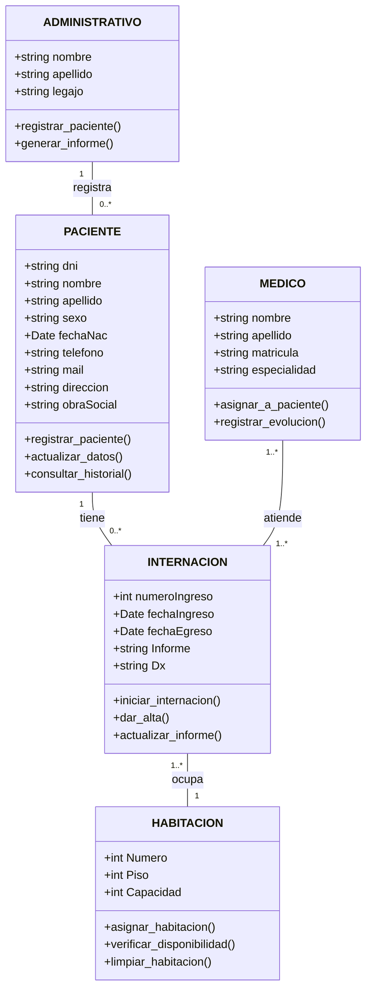

# Documentación del Diagrama de Clases

Este documento presenta un modelo de clases que describe la estructura de datos, las acciones y las relaciones de un sistema de gestión hospitalaria. Cada clase representa una entidad central del sistema, y sus atributos definen las propiedades y características que contendrá cada objeto. Las asociaciones entre clases detallan cómo se conectan e interactúan los diferentes componentes del sistema.

## Clases y Atributos

### **Clase PACIENTE**

**Descripción**: Representa a una persona que recibe atención en el hospital.

- **Atributos**:
  - `dni`: `string`
  - `nombre`: `string`
  - `apellido`: `string`
  - `sexo`: `string`
  - `fechaNac`: `Date`
  - `telefono`: `string`
  - `mail`: `string`
  - `direccion`: `string`
  - `obraSocial`: `string`
- **Métodos**:
  - `registrar_paciente()`: Crea un nuevo registro de paciente en el sistema.
  - `actualizar_datos()`: Modifica la información del paciente.
  - `consultar_historial()`: Accede al historial de internaciones y atención.

***

### **Clase INTERNACION**

**Descripción**: Representa un registro de hospitalización para un paciente.

- **Atributos**:
  - `numeroIngreso`: `int`
  - `fechaIngreso`: `Date`
  - `fechaEgreso`: `Date`
  - `Informe`: `string`
  - `Dx`: `string`
- **Métodos**:
  - `iniciar_internacion()`: Registra el ingreso de un paciente.
  - `dar_alta()`: Finaliza el período de hospitalización.
  - `actualizar_informe()`: Agrega o modifica el informe médico de la internación.

***

### **Clase HABITACION**

**Descripción**: Representa la habitación en la que un paciente se aloja durante su internación.

- **Atributos**:
  - `Numero`: `int`
  - `Piso`: `int`
  - `Capacidad`: `int`
- **Métodos**:
  - `asignar_habitacion()`: Asigna la habitación a una internación.
  - `verificar_disponibilidad()`: Consulta si la habitación está ocupada o libre.
  - `limpiar_habitacion()`: Marca la habitación como disponible después del alta del paciente.

***

### **Clase MEDICO**

**Descripción**: Representa al personal médico que atiende a los pacientes.

- **Atributos**:
  - `nombre`: `string`
  - `apellido`: `string`
  - `matricula`: `string`
  - `especialidad`: `string`
- **Métodos**:
  - `asignar_a_paciente()`: Asigna un médico a la internación de un paciente.
  - `registrar_evolucion()`: Documenta el progreso del paciente durante la internación.

***

### **Clase ADMINISTRATIVO**

**Descripción**: Representa al personal administrativo encargado de los registros de pacientes.

- **Atributos**:
  - `nombre`: `string`
  - `apellido`: `string`
  - `legajo`: `string`
- **Métodos**:
  - `registrar_paciente()`: Procesa el registro de un nuevo paciente.
  - `generar_informe()`: Crea reportes administrativos sobre pacientes o internaciones.

***
### Relaciones (Asociaciones)

Las siguientes asociaciones describen las conexiones entre las clases, indicando cómo los objetos se relacionan entre sí.

- *PACIENTE* e *INTERNACION*:
  - Un PACIENTE está asociado con cero o muchas INTERNACION.
  - Una INTERNACION está asociada con exactamente un PACIENTE.

- *INTERNACION* y *HABITACION*:
  - Una INTERNACION está asociada con exactamente una HABITACION.
  - Una HABITACION está asociada con cero o muchas INTERNACION.

- *MEDICO* e *INTERNACION*:
  - Un MEDICO está asociado con cero o muchas INTERNACION.
  - Una INTERNACION está asociada con uno o muchos MEDICO.

- *ADMINISTRATIVO* y *PACIENTE*:
  - Un ADMINISTRATIVO está asociado con cero o muchos PACIENTE.
  - Un PACIENTE está asociado con exactamente un ADMINISTRATIVO.

