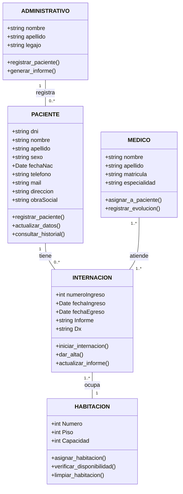

# Documentación del Diagrama de Clases

Este documento presenta un modelo de clases que describe la estructura de datos, las acciones y las relaciones de un sistema de gestión hospitalaria. Cada clase representa una entidad central del sistema, y sus atributos definen las propiedades y características que contendrá cada objeto. Las asociaciones entre clases detallan cómo se conectan e interactúan los diferentes componentes del sistema.

## Clases y Atributos

### **Clase PACIENTE**

**Descripción**: Representa a una persona que recibe atención en el hospital.

- **Atributos**:
  - `dni`: `string`
  - `nombre`: `string`
  - `apellido`: `string`
  - `sexo`: `string`
  - `fechaNac`: `Date`
  - `telefono`: `string`
  - `mail`: `string`
  - `direccion`: `string`
  - `obraSocial`: `string`
- **Métodos**:
  - `registrar_paciente()`: Crea un nuevo registro de paciente en el sistema.
  - `actualizar_datos()`: Modifica la información del paciente.
  - `consultar_historial()`: Accede al historial de internaciones y atención.

***

### **Clase INTERNACION**

**Descripción**: Representa un registro de hospitalización para un paciente.

- **Atributos**:
  - `numeroIngreso`: `int`
  - `fechaIngreso`: `Date`
  - `fechaEgreso`: `Date`
  - `Informe`: `string`
  - `Dx`: `string`
- **Métodos**:
  - `iniciar_internacion()`: Registra el ingreso de un paciente.
  - `dar_alta()`: Finaliza el período de hospitalización.
  - `actualizar_informe()`: Agrega o modifica el informe médico de la internación.

***

### **Clase HABITACION**

**Descripción**: Representa la habitación en la que un paciente se aloja durante su internación.

- **Atributos**:
  - `numero`: `int`
  - `piso`: `int`
  - `capacidad`: `int`
- **Métodos**:
  - `asignar_habitacion()`: Asigna la habitación a una internación.
  - `verificar_disponibilidad()`: Consulta si la habitación está ocupada o libre.
  - `limpiar_habitacion()`: Marca la habitación como disponible después del alta del paciente.

***

### **Clase USUARIO**

**Descripción**: Representa un usuario del sistema, que puede tener diferentes roles:

- **Atributos**:
  - `nombre`: `string`
  - `apellido`: `string`
  - `email`: `string`
  - `contrasena`: `string`
  - `matricula`: `string` (opcional)
  - `especialidad`: `string` (opcional)
- **Métodos**:
  - `login()`: Para loguearse al sistema.
  - `asignar_Rol()`: Para asignar roles a los usuarios.
  - `registrar_paciente()`: Para registrar un nuevo paciente en el sistema.
  - `internar_paciente()`: Médico indica internación a paciente.
  - `registrar_internacion()`: Para iniciar un nuevo proceso de internación.
  - `asignar_medico()`: Asigna el paciente a un médico que realizará el seguimiento durante la internación.
  - `registrar_evolucion()`: Documenta diariamente el progreso del paciente durante la internación.
  - `generar_informe_administrativo()`: Crea reportes administrativos sobre pacientes o internaciones

***

### **Clase ROL**

**Descripción**: Define los roles posibles que puede tener un usuario.

- **Atributos**:
  - `nombre`: `string`
  - `descripcion`: `string`  

***

### Relaciones (Asociaciones)

Las siguientes asociaciones describen las conexiones entre las clases, indicando cómo los objetos se relacionan entre sí.

- *PACIENTE* e *INTERNACION*:
  - Un PACIENTE puede tener muchas o ninguna INTERNACION.
  - Una INTERNACION está asociada con exactamente un PACIENTE.

- *INTERNACION* y *HABITACION*:
  - Una INTERNACION está asociada con exactamente una HABITACION (no puede estar en más de una habitación simultáneamente).
  - Una HABITACION está asociada con cero o muchas INTERNACIONes(cantidad de camas ocupadas).

- *USUARIO* y *PACIENTE*:
  - Un usuario (administrativo) puede registrar a uno o muchos pacientes
  - Un usuario (médico) puede derivar a internacion a uno o muchos pacientes.
  - El paciente debe ser registrado solo una vez en el sistema

- *USUARIO* e *INTERNACION*:
  - Un usuario con rol administrativo puede registrar a uno o muchas internaciones.
  - Un usuario con rol medico puede atender uno o muchas internaciones simultáneamente.

- *USUARIO* y *ROL*:
  - Un usuario puede tener uno o muchos roles
  - Un rol puede ser asignado a uno o muchos usuarios.

